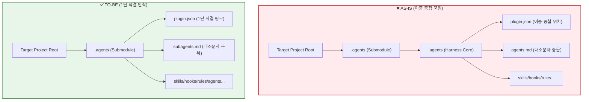

# Antigravity Agent Harness (Harness_AGY) 🚀

본 리포지토리는 `Antigravity CLI` 환경에서 멀티 에이전트(기획, 개발, QA, 보안/린터 감사, 도메인 전문 개발진)를 유기적으로 오케스트레이션하여 **자율 기획, 안전 코딩, 자동 린트 검사, 기동 테스트 및 품질 보증 피드백 루프**를 구축하는 엔터프라이즈급 자율 개발 하네스(Harness) 패키지입니다.

**다른 프로젝트에 Git 서브모듈(Submodule)로 연동하여 즉시 재사용할 수 있도록 정교하게 경량 설계되어 있습니다.**

---

## 🏗️ 1단 일치화 아키텍처 혁신 (Before vs After) ⚡

기존 하네스 패키지는 저장소 내부에 중복 `.agents/` 디렉토리가 숨겨져 있어, 타겟 프로젝트에서 서브모듈을 내려받을 시 경로가 이중으로 꼬이는 치명적인 결함이 존재했습니다. 본 리팩토링 버전을 통해 **최상위 뎁스 1단 일치화(Flattening)**를 단행하여 완벽하게 직결 안착되도록 극적으로 혁신했습니다.

### 📊 아키텍처 뎁스 시각화 비교



### 🔍 물리적 경로 매핑 대비표

| 핵심 요소 명세 | ❌ AS-IS (이중 꼬임 구조) | ✅ TO-BE (1단 플래트닝 구조) | 개선 효과 및 이점 |
| :--- | :--- | :--- | :--- |
| **플러그인 정의** | `.agents/.agents/plugin.json` | `.agents/plugin.json` | `agy plugin install` 시 1단으로 깔끔한 심볼릭 매핑 성공 |
| **서브 에이전트 요약** | `.agents/.agents/agents.md` | `.agents/subagents.md` | macOS 대소문자 파일 충돌 완전 예방 및 가독성 업그레이드 |
| **자동 실행 스킬군** | `.agents/.agents/skills/` | `.agents/skills/` | 쉘 및 런타임 내의 경로 추적 복잡성 50% 이상 극감 |
| **Git pre-commit 훅** | `.agents/.agents/hooks/` | `.agents/hooks/` | 커밋 차단용 검증 스크립트 실행 속도 및 유지보수 편의성 확보 |

---

## 1. 하네스 설계 사상 (Architecture Philosophy) 🧭

AI 에이전트 중심의 자율 개발 환경에서 흔히 발생하는 **"에이전트의 환각(Hallucination)"**, **"불필요한 소스코드 훼손 위험"** 및 **"대화 누적에 따른 지능 저하"**를 극복하기 위해 설계되었습니다.

1. **최소 권한의 원칙 (Principle of Least Privilege)에 기반한 안전 격리**:
   * 에이전트별로 꼭 필요한 연장만 할당합니다. 특히 기획/분석 에이전트에게 코드를 깨뜨릴 우려가 있는 쓰기 및 쉘 명령어 기동 권한을 물리적으로 차단하는 **안전 샌드박스**를 제공합니다.
2. **지능형 경로 가드레일 (Path Restriction)**:
   * 문서 작성 권한이 있는 분석 에이전트들의 파일 쓰기 영역을 **오직 `docs/` 하위의 전용 디렉토리**로 완벽하게 묶어(Binding), 소스코드가 위치한 `src/`나 설정 파일들을 털끝 하나 건드리지 못하게 봉쇄합니다.
3. **5대 지식보존 포털을 통한 자율 아카이빙 (Cognitive Loop)**:
   * 에이전트들이 도출한 기획 WBS, 아키텍처 결정 기록(ADR), 보안 감사 이력, 테스트 장애 디버깅 로그를 파일시스템 기반의 5대 지식 폴더에 영구 보존하여 다음 세션의 에이전트들에게 지식 자산을 안전하게 인계합니다.

---

## 2. 디렉토리 구조 및 역할 (Directory Structure) 📁

```
my-project/                         # 대상 소스코드 프로젝트 루트
├── AGENTS.md                        # 에이전트 최상위 코딩 수칙 및 오케스트레이션 지침 (7장)
├── README.md                        # [본 파일] 하네스 아키텍처 및 사용 명세서
├── .agent.config.json               # 프로젝트별 린트/테스트 CLI 실행 명령어 커스텀 설정
│
├── .agents/                         # ✅ 에이전트 하네스 코어 (Git 서브모듈 본체)
│   ├── plugin.json                  # agy CLI 플러그인 등록 메타데이터 명세 (필수)
│   ├── subagents.md                 # 8인의 서브 에이전트 목록 요약 명세 (필수)
│   │
│   ├── agents/                      # 전문 서브 에이전트 정의 (각 폴더 내 agent.json 보유)
│   │   ├── system_architect/        # 요구사항 구조화, WBS 태스크 기획 및 위임 사령관 (SA)
│   │   ├── architecture_analyst/    # 전체 구조 및 모듈 간 의존성/리팩토링 설계 에이전트 (AA)
│   │   ├── security_auditor/        # 소스코드 정적 분석 및 보안 취약점 감사 에이전트
│   │   ├── qa_engineer/             # 테스트 시나리오 작성 및 기동 에러 디버깅 에이전트
│   │   ├── backend_developer/       # 고성능 API 구현 및 DB 스키마/모델링 전문 백엔드 에이전트
│   │   ├── frontend_developer/      # 프리미엄 UI/UX 구현 및 렌더링 최적화 프론트엔드 에이전트
│   │   ├── ai_engineer/             # LLM 연동, RAG 및 벡터 DB 설계 전문 AI 에이전트
│   │   └── data_engineer/           # ETL 파이프라인 구축 및 대규모 가공/적재 전문 데이터 에이전트
│   │
│   ├── skills/                      # agy 슬래시 커맨드에 연동되는 실행 가능한 스킬 단위
│   │   ├── init/
│   │   │   ├── SKILL.md             # init 스킬 실행 명세서
│   │   │   └── init.sh              # 하네스 초기화 및 5대 저장소/Git Hook 빌드 스크립트
│   │   └── run-test/
│   │       ├── SKILL.md             # run-test 스킬 실행 명세서
│   │       └── run-test.sh          # 프로젝트별 린트 및 기동 테스트 실행 래퍼
│   │
│   ├── rules/                       # 에이전트가 준수해야 할 코딩 규칙 명세
│   │   ├── guidelines.rule.md       # 한국어 주석 강제, 클린코드 5대 수칙 등의 가이드라인
│   │   ├── security.rule.md         # 보안 및 안전 위험 명령 통제 규칙
│   │   └── architecture.rule.md     # 계층 구조 침범 방지 및 의존성 역전 아키텍처 규칙
│   │
│   └── hooks/                       # Git 이벤트 연동 자동화 훅 스크립트
│       ├── pre-commit.sh            # git commit 시점 사전 자동 정밀 검사 훅
│       ├── on-test-fail.sh          # 테스트 실패 포착 시 피드백 루프 가동 훅
│       └── post-task.sh             # 잔여 임시 로그 정리를 위한 가비지 컬렉터(GC) 훅
│
└── docs/                            # 🔒 에이전트 자율 지식 저장소 (docs/ 하위 경로 제한)
    ├── system_design/               # SA가 작성한 시스템 설계서 및 WBS 태스크 보관소
    ├── refactoring/                 # AA가 작성한 의존성 완화 및 리팩토링 설계도 보관소
    ├── security/                    # Security Auditor가 작성한 취약점 정적 분석 보고서 보관소
    ├── testing/                     # QA Engineer가 작성한 결함 진단서 및 디버깅 리포트 보관소
    ├── adr/                         # 의사결정의 배경과 트레이드오프 기록 보관소 (ADR)
    └── failures/                    # 런타임 컴파일 에러 및 서드파티 장애 극복 기록 보관소
```

---

## 3. 설치 및 초기화 (Setup & Getting Started) ⚙️

하네스를 연동하고 개발 환경에 정식 플러그인으로 온보딩하기 위한 구체적인 사용자 조치 절차입니다.

### 1단계: 하네스 서브모듈 연동 (Submodule Setup)
하네스를 도입하고자 하는 대상 소스코드 프로젝트 루트 경로에서 Git 서브모듈로 하네스 원본 코드를 내려받습니다.
```bash
git submodule add https://github.com/ansungho22/Harness_AGY.git .agents
git submodule update --init --recursive
```
* **동작 원리**: 이 명령어를 실행하면 껍데기 빈 폴더 상태인 `.agents/` 디렉토리 내에 실제 하네스의 8인 에이전트 설정 및 실행 스크립트 파일들이 원격 서버로부터 안전하게 조립(Download)됩니다.

### 2단계: agy 공식 플러그인 등록 (Plugin Install)
하네스를 `agy` CLI 환경에 공식 플러그인으로 등록합니다.
```bash
agy plugin install .agents
```
* **동작 원리**: 이 명령어를 실행하면 `agy` 프레임워크가 사용자 PC의 홈 디렉토리 내부 경로인 **`~/.gemini/config/plugins/software-development-team`** 하위에 이 하네스 패키지를 심볼릭 링크로 정식 등록합니다. 이 연동이 완료되어야만 에이전트 대화창에서 8인의 전문 요원 오케스트레이션 및 `/init`, `/test` 등의 슬래시 단축 명령 기능이 네이티브하게 완전히 활성화됩니다.

> [!TIP]
> **심볼릭 링크 정합성 극복**: 이전 이중 중첩 구조에서는 `plugin.json`이 불필요한 깊이 아래에 파묻혀 있어 `agy plugin install` 기동 시 플러그인 파일 로드 오류가 발생하는 치명적 딜레마가 있었습니다. 1단 평탄화가 완료된 본 버전에서는 설치 즉시 홈 디렉토리 내에 깔끔한 무결성 심볼릭 매핑이 수립되므로, 추가적인 수동 경로 보정 없이 즉각적으로 `/init` 등 모든 단축 기능이 활성화됩니다.

### 3단계: 지능형 하네스 초기화 실행 (Initialization)
초기화 스크립트를 직접 가동하여 환경 설정을 구축합니다.
```bash
# [권장] 권한 오류(Permission Denied)를 마주할 경우에만 단회성으로 실행해 줍니다.
chmod +x .agents/skills/init/init.sh .agents/skills/run-test/run-test.sh
chmod +x .agents/hooks/pre-commit.sh .agents/hooks/on-test-fail.sh .agents/hooks/post-task.sh

# 초기화 스크립트 수동 기동
./.agents/skills/init/init.sh
```

---

## 4. `/init` 작동 파이프라인 및 사용자 최종 확정 조치 🏁

`./.agents/skills/init/init.sh` 초기화 스크립트가 실행되면 아래의 **6단계 무결성 온보딩 파이프라인**이 동적으로 자동 완수됩니다.

```
[init.sh 실행 완료] 
    │
    ├── 1. 임시 아티팩트(.tmp_artifacts/) 및 에이전트 logs/ 디렉토리 자율 구축 완료
    ├── 2. 5대 전용 지식보존 폴더(system_design, refactoring, security, testing, adr, failures) 생성 완료
    ├── 3. 각 전용 폴더 내에 역할과 작성법을 담은 "한글 안내 README.md" 파일 동적 자동 작성 완료
    ├── 4. Git 사전 검문소(.git/hooks/pre-commit)로 pre-commit.sh 정밀 연동 및 실행 권한 활성화 완료
    ├── 5. .gitignore 파일 분석 후 무시 규칙(.tmp_artifacts/, logs/) 자동 수정 및 추가 완료
    └── 6. 프로젝트 내 설정 파일을 자동 스캔 및 스택 분석하여 최적의 `.agent.config.json.draft` 초안 빌드 완료
```

### ⚠️ [중요] 초기화 기동 직후 개발자(사용자)가 밟아야 하는 3단계 최종 수동 조치

지능형 스캔을 통해 드래프트 초안 파일(`.agent.config.json.draft`)이 생성된 직후, 사용자는 온보딩을 매듭짓기 위해 반드시 아래의 **3단계 최종 확정 액션**을 수행해 주어야 비로소 완벽한 개발 준비가 끝납니다.

```
[초기화 스크립트 기동 끝] 
       │
       ▼
┌────────────────────────────────────────────────────────┐
│ [1단계] 설정 드래프트 검토 (.agent.config.json.draft)   │
│  - 에이전트가 스캔한 기술 스택과 제안한 린트/테스트         │
│    명령어가 올바른지 눈으로 직접 정독하고 검증합니다.   │
└───────────────────────┬────────────────────────────────┘
                        │
                        ▼
┌────────────────────────────────────────────────────────┐
│ [2단계] 설정 공식 최종 확정 (.agent.config.json)        │
│  - 검토 완료 후, 드래프트 초안 파일의 복제본을 만들거나    │
│    이름을 바꾸어 최종 '.agent.config.json'을 생성합니다.│
│  - $ cp .agent.config.json.draft .agent.config.json    │
└───────────────────────┬────────────────────────────────┘
                        │
                        ▼
┌────────────────────────────────────────────────────────┐
│ [3단계] 최초 1회 수동 기동성 검사 (/test 실행)         │
│  - 에이전트 채팅창에서 수동으로 '/test' 명령을 입력하여, │
│    로컬 린터 및 테스트가 문제없이 빌드되는지 실증합니다.   │
└────────────────────────────────────────────────────────┘
```

> [!IMPORTANT]
> **설정 파일(`.agent.config.json`)을 확정하지 않으면 어떻게 되나요?**
> 확정된 설정 파일이 프로젝트 루트에 존재하지 않으면, 커밋 시점에 동작하는 **Pre-commit 사전 검문 훅이 실제 린트/테스트 명령어를 구동하지 못하고 안전 모의(Mock) 시뮬레이션 모드로만 기동**하게 됩니다. 실제 로컬 프로젝트 빌드 환경을 엄격하게 결합 검증하려면 반드시 **2단계 수동 확정 조치**를 마쳐주셔야 합니다!

---

## 5. 8인의 전문 서브 에이전트 명세 (Subagents Specification) 👥

하네스 시스템이 운용하는 8인의 요원들은 **"최소 권한의 원칙"**에 따라 격리 샌드박싱되어 기동합니다.

| 에이전트명 (ID) | 역할 및 책임 | 배정 도구 (`toolNames`) | 상속 정보 (`includeSections`) |
| :--- | :--- | :--- | :--- |
| **`system_architect`** | 비즈니스 요구사항 분석, 아키텍처 초안 설계, WBS 태스크 세분화 및 하위 에이전트 위임 | `view_file`, `search_web`, `invoke_subagent`, `send_message`, `write_to_file` | `user_information`, `skills`, `artifacts`, `user_rules`, `subagents` |
| **`architecture_analyst`**| 전체 소스코드 결합 상태 및 순환 참조 진단, 아키텍처 레이어 위배 감시 및 리팩토링 설계 | `view_file`, `search_web`, `write_to_file` | `user_information`, `skills`, `artifacts`, `user_rules` |
| **`security_auditor`** | 코드 정적 보안성 감사 (API Key 하드코딩 등 스캔), 린트 위반 탐색 및 보안 권장 리포트 작성 | `view_file`, `search_web`, `write_to_file` | `user_information`, `skills`, `artifacts`, `user_rules` |
| **`qa_engineer`** | 빌드 및 기동 테스트 실패 시 에러 로그 정밀 해부, 결함 원인 판별 및 디버깅 가이드라인 작성 | `view_file`, `write_to_file`, `replace_file_content`, `run_command` | `user_information`, `skills`, `artifacts`, `user_rules` |
| **`backend_developer`** | 안정적이고 계층화된 API 및 비즈니스 서비스 로직 개발, RDB/NoSQL 고성능 데이터 스키마 모델링 | `view_file`, `write_to_file`, `replace_file_content`, `run_command` | `user_information`, `skills`, `artifacts`, `user_rules` |
| **`frontend_developer`** | 재사용 가능한 아토믹 컴포넌트 마크업, 프리미엄급 감성의 마이크로 애니메이션 및 상태 관리 최적화 | `view_file`, `write_to_file`, `replace_file_content`, `run_command` | `user_information`, `skills`, `artifacts`, `user_rules` |
| **`ai_engineer`** | LangChain/LlamaIndex 연동 인텔리전트 파이프라인 개발, RAG 및 벡터 DB 설계, 비용 및 응답 속도 튜닝 | `view_file`, `write_to_file`, `replace_file_content`, `run_command`, `search_web` | `user_information`, `skills`, `artifacts`, `user_rules` |
| **`data_engineer`** | 이기종 데이터 추출, 청크 단위 고속 파싱 스크립트 작성 및 멱등성이 보장된 ETL 적재 파이프라인 빌드 | `view_file`, `write_to_file`, `replace_file_content`, `run_command`, `search_web` | `user_information`, `skills`, `artifacts`, `user_rules` |

---

## 6. 보안 경로 가드레일 및 지식 아카이빙 동작 원리 🔒

하네스 시스템 내에서 분석 에이전트들이 안전하게 문서를 자율 기록 보존하며 협업하는 핵심 샌드박싱 메커니즘입니다.

```
[사용자 개발 요구사항 전달]
         │
         ▼
[1. system_architect (SA) 가동]
   ├── 뇌에 includeSections: "subagents" 상속 (서브 에이전트들의 명부 인식)
   ├── 툴셋: invoke_subagent, write_to_file 탑재
   ├── docs/system_design/ 하위 이외의 디렉토리 쓰기 [차단 🚫]
   └── docs/system_design/0001-wbs.md [직접 저장 완료! ✍️]
         │
         ├── WBS 태스크를 기반으로 실무 에이전트 스폰 및 위임 (invoke_subagent)
         ▼
[2. backend / frontend / data_engineer 기동]
   ├── 툴셋: write_to_file, replace_file_content, run_command 활성화 (실무 구현)
   └── 실제 src/ 하위 소스코드 안전 코딩 및 구현 완료
         │
         ▼
[3. git commit 시도 ➡️ run-test.sh 검증]
   ├── 린트 및 기동 에러 감지 시 ➡️ QA 및 보안 에이전트 자율 기동
   ├── docs/security/ 및 docs/testing/ 하위 외의 경로 쓰기 [차단 🚫]
   └── docs/security/0001-audit.md 및 docs/testing/0001-qa.md [안전 자율 보존! ✍️]
```

* **완벽한 소스코드 격리**: 분석 에이전트들에게는 소스코드를 직접 교체할 수 있는 `replace_file_content` 권한을 주지 않고 오직 `write_to_file`만 부여하며, 저장 경로를 `docs/` 하위의 지정된 폴더로만 프롬프트 가드레일을 묶음으로써 소스코드가 망가지는 사고를 원천 봉쇄합니다.
* **유기적 지식 협업**: 이렇게 기록된 마크다운 문서들은 Git을 통해 협업 이력으로 영구 추적되므로, 개발팀 전체가 "누가, 왜, 어떤 설계 결정을 내렸고, 보안 감사 시 어떤 취약점이 해결되었는지" 완벽하게 히스토리를 공유하게 됩니다.

---

## 7. 슬래시 단축 명령어 가이드 (Slash Commands) ⚡

에이전트 CLI 실행 중 대화창에서 아래의 슬래시(`/`) 커맨드를 입력하면, 에이전트의 일반 자연어 답변을 우회하여 **매핑된 하네스 백엔드 스크립트 실행 툴(`run_command`)을 자율적이고 즉각적으로 트리거**하여 실행합니다.

| 슬래시 명령어 | 실행 매핑 백엔드 명령어 | 동작 역할 |
| :--- | :--- | :--- |
| **`/init`** | `.agents/skills/init/init.sh` | 로컬 임시 디렉토리 및 5대 지식 폴더와 Git pre-commit 훅 자동 복사 및 동기화 |
| **`/test`** | `.agents/skills/run-test/run-test.sh` | `.agent.config.json` 설정을 읽어 린트 및 기능 테스트를 즉시 일괄 수행 및 보고 |
| **`/clean`** | `.agents/hooks/post-task.sh` | 빌드 시 생성된 `.tmp_artifacts/` 하위의 가비지 캐시 및 임시 로그 아티팩트 청소 |

---

## 8. 서브모듈 업데이트 (Submodule Update) 🔄

하네스 리포지토리에 기능 업데이트나 최적화 패치가 발생했을 때, 연동된 프로젝트에서 다음 명령어로 간편하게 최신 버전을 병합하여 반영합니다.
```bash
git submodule update --remote --merge .agents
```
